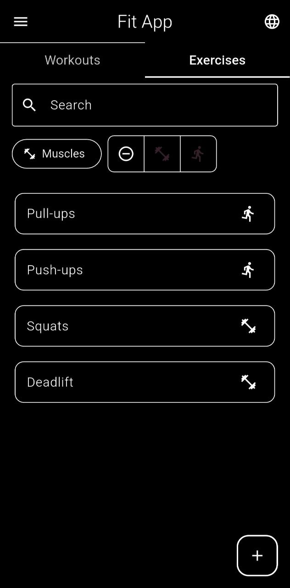
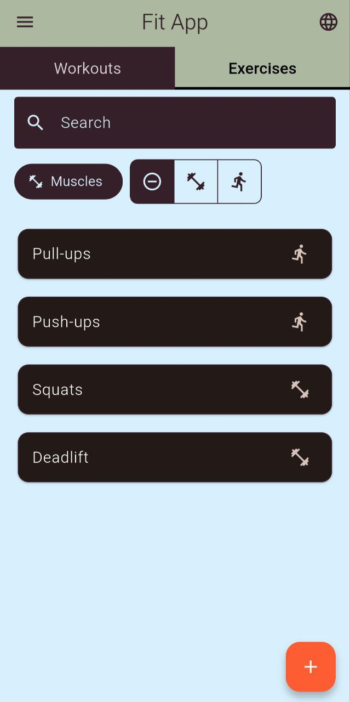
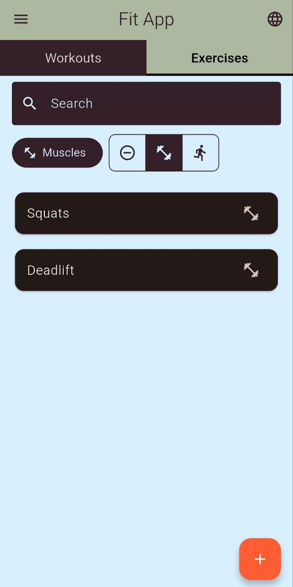
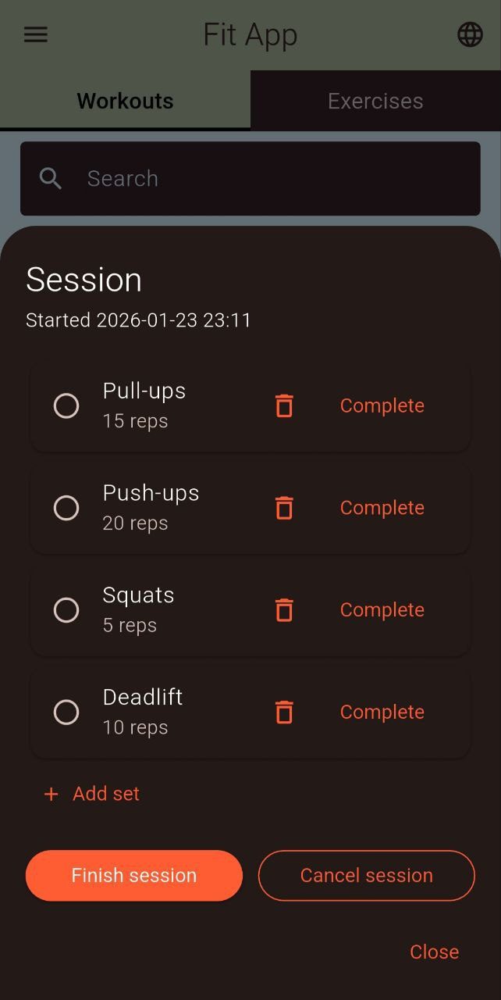

# Fit APP 🦾

Fit APP is a mobile application for planning workouts, managing exercises, and tracking training history. It helps you build workout structures, organize categories, and quickly find the exercises you need.

## Features
- Create, edit, and delete workouts and exercises 🏋️‍♂️
- Plan sets with reps and weights ✍️
- Filter exercises by muscle groups and load type 🔎 
- Fast search across workouts and exercises 📔
- Workout history and detailed session view 🗓️
- Interface localization (multiple languages) 🌐
- Theme support (light/dark mode) 🎨

## Screenshots

  
  
  
  

